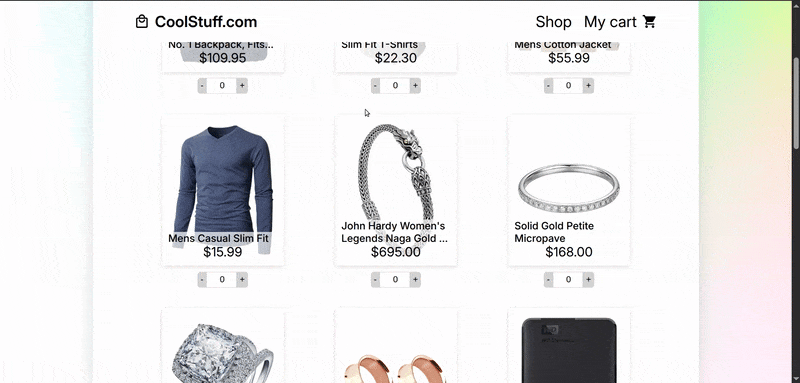

# 🛒 Shopping Cart

A mock e-commerce site built with React that allows users to browse items and manage a shopping cart in real time.

🔗 [Live Demo on Netlify](https://coolstuffshop.netlify.app/)

---

## ⚙️ Technologies Used

- React  
- JavaScript (ES6+)  
- CSS Modules  
- Vite

---

## ✨ Features

- Dynamic cart functionality (add, remove, and update item quantities)  
- Real-time cart total updates using `useMemo`  
- Modular component-based design  
- Product data fetched from the [FakeStoreAPI](https://fakestoreapi.com/)  
- Responsive UI structure in progress

---

## 📚 What I Learned

- Deepened understanding of React component structure and props  
- Improved state management using `useContext`  
- Practiced conditional rendering and dynamic UI updates  
- Used `useMemo` for efficient total price calculation  
- Gained experience deploying React apps with Netlify  
- Integrated external APIs into a React project

---

## 🚧 Future Improvements

- Add lazy loading to product images for performance optimization  
- Implement smooth loading animations and transitions  
- Make the layout fully responsive for mobile and tablet devices  
- Add filtering/sorting options
